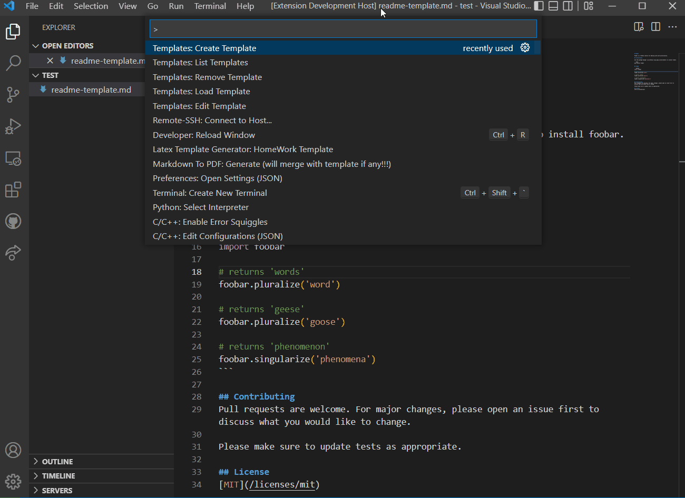
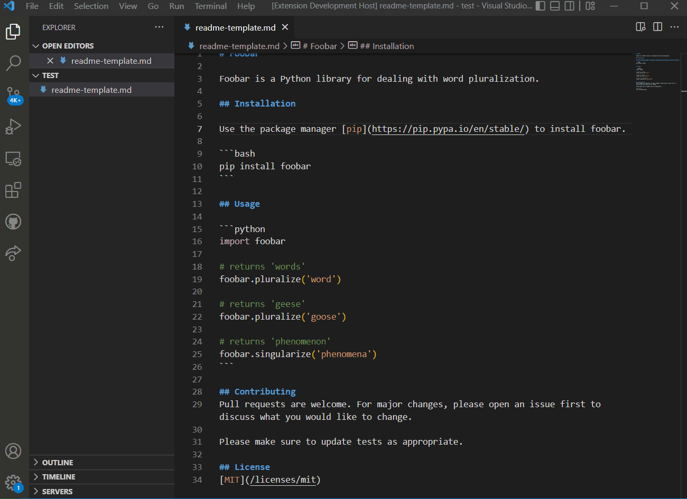
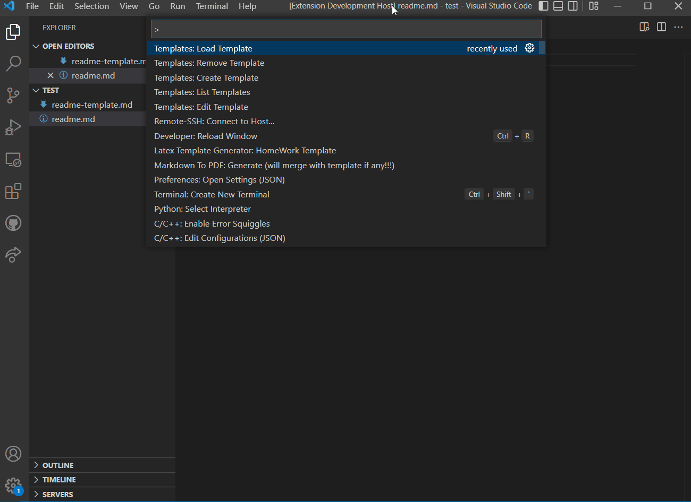
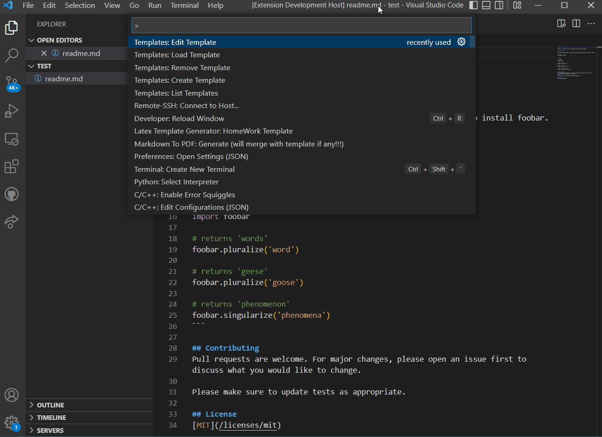
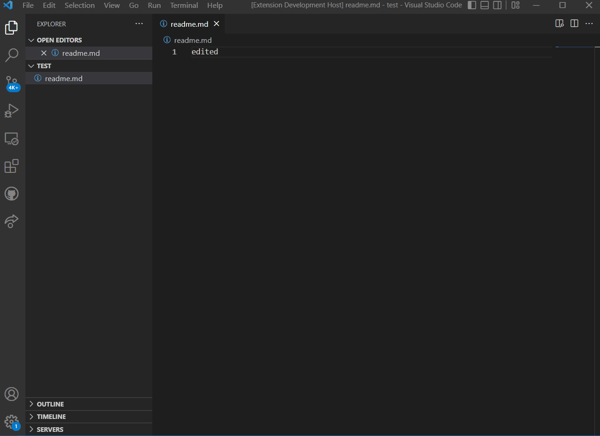

# Templates

Create your own custom templates for quick access.

Use `Ctrl+Shift+P` (Windows) or `Cmd+Shift+P` (Mac) to vs code command palette.

## Features

- Create template

command: `Templates: Create Template`

`Templates` uses the active editor to create a new template. if there is no active editor, it will ask for a file path.

- List templates

command: `Templates: List Templates`

`Templates` will dump all templates to console.

- Load template

command: `Templates: Load Template`

Select a template from the list and load it.

- Edit template

command: `Templates: Edit Template`

`Templates` will open the template in the editor so you can edit it.

- Remove template

command: `Templates: Remove Template`

Select a template from the list and delete it.

